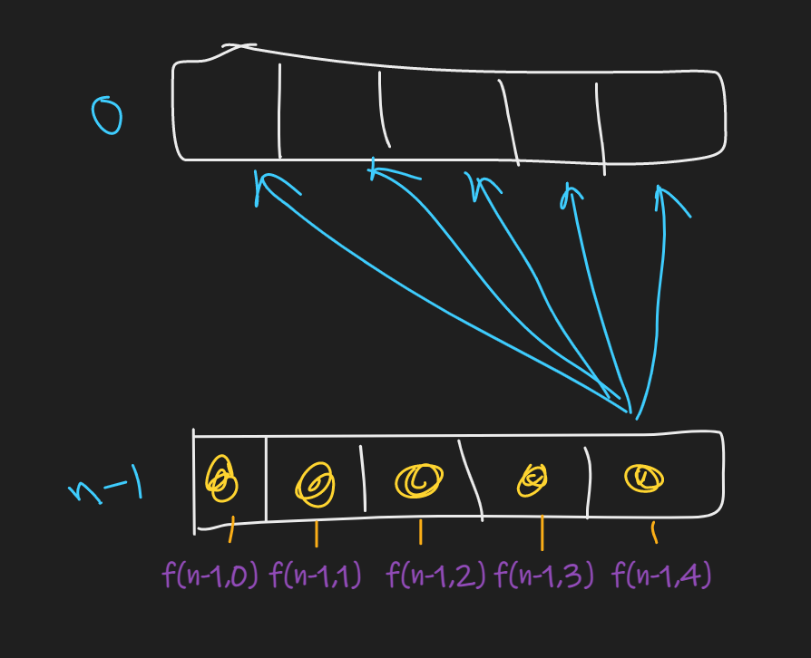

## Problem:

> You have been given an N\*M matrix filled with integer numbers, find the maximum sum that can be obtained from a path starting from any cell in the first row to any cell in the last row.
> From a cell in a row, you can move to another cell directly below that row, or diagonally below left or right. So from a particular cell (row, col), we can move in three directions i.e.

```
Down: (row+1,col)
Down left diagonal: (row+1,col-1)
Down right diagonal: (row+1, col+1)
```

## Example:

### Input 1 :

```
2
4 4
1 2 10 4
100 3 2 1
1 1 20 2
1 2 2 1
3 3
10 2 3
3 7 2
8 1 5
```

### Output 1 :

```
105
25
```

### Explanation Of Input 1 :

```
In the first test case for the given matrix,
```


```
The maximum path sum will be 2->100->1->2, So the sum is 105(2+100+1+2).

In the second test case for the given matrix, the maximum path sum will be 10->7->8, So the sum is 25(10+7+8).
```

## Approach:

--> Here both starting and ending points are not fixed so we have to calculate all the possibilities for starting and ending point like this:



So we will find max path sum for all elements in the row and then count the maximum of them.

## Base case 

--> Here we will have 2 base case:

1. If we reach `0`
2. If index reaches out of matrix means less than 0 and greater than n-1

So if we reach `0` then we will simply return the element at first row for current j.

```cpp
if(i == 0){
	return arr[0][j];
}
```

For condition 2:

```cpp
// we are finding maximum value so we will return smallest value here so that it will be not considered in max.
if(i < 0 || i >= n){
	return -1e9;
}
```

--> Now we have 3 paths which will be completely opposite of the paths given in question because we are starting from last row.


So the recursive code will look like this:

```cpp
int solve(int i,int j,vector<vector<int>>&arr,int n){
	if(i == 0){
		return arr[i][j];
	}
	if(i < 0 || i >= n){
		return -1e9;
	}
	int up = arr[i][j] + solve(i-1,j,arr,n);
	int ld = arr[i][j] + solve(i-1,j-1,arr,n);
	int rd = arr[i][j] + solve(i-1,j+1,arr,n);
	return max(up,max(ld,rd));
}
int main(){
	int ans = 0;
	for(i=0;i<n;i++){
		ans = max(ans,solve(n-1,i,arr,n));
	}
	cout<<ans<<endl;
}
```

## Complexity:

```
Time complexity: O(3^n)
Space complexity: O(n)
```

## Memoization Code:

--> Here we can see that there are some overlapping subproblems so we can use memoization here:

we will make `dp` matrix of size `NxM` where N is number of rows and M is number of columns.

--> Memoization code will look like this:

```cpp
int solve(int i,int j,vector<vector<int>>&arr,int n,vector<vector<int>>&dp){
	if(i == 0){
		return arr[i][j];
	}
	if(i < 0 || i >= n){
		return -1e9;
	}
	if(dp[i][j] != -1){
		return dp[i][j];
	}
	int up = arr[i][j] + solve(i-1,j,arr,n,dp);
	int ld = arr[i][j] + solve(i-1,j-1,arr,n,dp);
	int rd = arr[i][j] + solve(i-1,j+1,arr,n,dp);
	return dp[i][j] = max(up,max(ld,rd));
}
int main(){
	int ans = 0;
	vector<vector<int>>dp(n,vector<int>(n,0));
	for(i=0;i<n;i++){
		ans = max(ans,solve(n-1,i,arr,n,vector));
	}
	cout<<ans<<endl;
}
```

## Complexity:

```
Time complexity: O(NxM)
Space complexity: O(NxM) // For matrix  + O(N) // For stack space
```

## Tabulation Code

```cpp
int solve(vector<vector<int>>&arr){
	vector<vector<int>>dp(n,vector<int>(m,0));
	// Base case
	for(int j=0;j<m;j++){
		dp[0][j] = arr[0][j];
	}
	for(int i=1;i<n;i++){
		for(int j=0;j<m;j++){
			int ld = arr[i][j],rd=arr[i][j];
			int up = arr[i][j] + dp[i-1][j];
			// Managing out of bound cases
			if(j>0){
				ld = arr[i][j] + dp[i-1][j-1];
			}
			// Managing out of bound cases
			if(j<n-1){
				rd = arr[i][j] + dp[i-1][j+1];
			}
			dp[i][j] = max(up,max(ld,rd));
		}
	}
	int maxi = dp[n-1][0];
	for(int i=1;i<m;i++){
		maxi = max(maxi,dp[n-1][i]);
	}
	return maxi;
}
```

## Complexity:

```
Time complexity: O(NxM) + O(M)
Space complexity: O(NxM)
```

## Space optimisation

--> Here also we can do space optmisation using the `prev` and `curr` array.

```cpp
int solve(vector<vector<int>>&arr){
	vector<int>prev(m,0),curr(m,0);
	// Base case
	for(int j=0;j<m;j++){
		prev[j] = arr[0][j];
	}
	for(int i=1;i<n;i++){
		for(int j=0;j<m;j++){
			int ld = -1e8,rd=-1e8;
			int up = arr[i][j] + prev[j];
			// Managing out of bound cases
			if(j>0){
				ld = arr[i][j] + prev[j-1];
			}
			// Managing out of bound cases
			if(j<n-1){
				rd = arr[i][j] + prev[j+1];
			}
			curr[j] = max(up,max(ld,rd));
		}
		prev = curr;
	}
	int maxi = prev[0];
	for(int i=1;i<m;i++){
		maxi = max(maxi,prev[i]);
	}
	return maxi;
}
```

