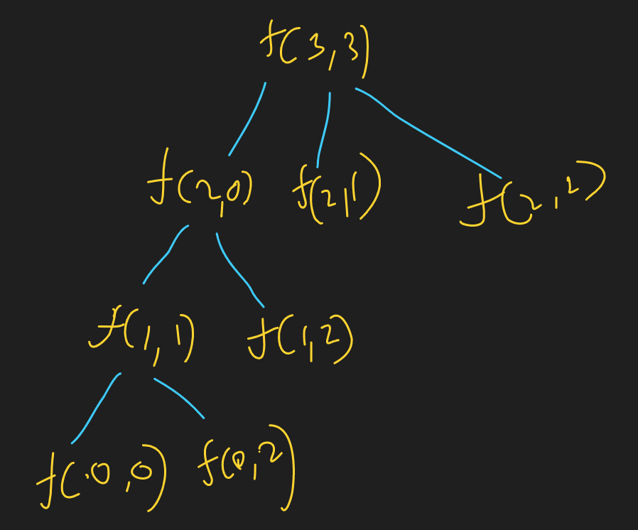

## Problem statement:

> Ninja is planing this ‘N’ days-long training schedule. Each day, he can perform any one of these three activities. (Running, Fighting Practice or Learning New Moves). Each activity has some merit points on each day. As Ninja has to improve all his skills, he can’t do the same activity in two consecutive days. Can you help Ninja find out the maximum merit points Ninja can earn?
> You are given a 2D array of size N\*3 ‘POINTS’ with the points corresponding to each day and activity. Your task is to calculate the maximum number of merit points that Ninja can earn.

## Example:

Input

```
[[10,50,3],[2,100,5]]
```

Output

```
110
```

## Approach:

--> So here if we thing greediely and take `50` points at first day then we can't take `100` on second day because as question says ==we can't do same activity on consecutive days== so the max answer will be `55` but the correct answer is `110` which is `10+100` so here we have to try all possible ways which we can do with ==recursion==

--> Here in function, we will need 2 things: 1)Current day and 2) The last activity done so that we can avoid doing same activity on consecutive days.

we will start from `n-1` and go till `0`

## Base case:

--> what if we reach 0?

Now we are at 0 and we know which task was performed previously so why don't we take the maximum of the remaining ones.
so we can do like this:

```cpp
solve(dayIdx,prevtaskIdx){
	if(dayIdx == 0){
		int maxi = 0;
		for(i=0;i<2;i++){
			if(i!=prevtaskIdx){
				maxi = max(maxi,task[dayIdx][i]);
			}
		}
		return maxi;
	}
}
```

--> Same thing we will do for current day too.
we will run a loop for `(0->2)` and if i is not index then we will count the merit point for ith index like this:

```cpp
int points = task[dayIdx][i] + solve(dayIdx-1,i); // recursion will solve the remaining points you just have to pass dayIdx-1 and the taskindex which you currently done.
```

==At last we will return the maximum value of points==

```cpp
int maxi = 0;
for(int i=0;i<2;i++){
	if(i != prevtaskIdx){
		int points = task[dayIdx][i] + solve(dayIdx-1,i);
		maxi = max(maxi,points);
	}
}
return maxi;
```

And our recursion code is done!

==Also when you are at `n-1` then pass prevtaskIdx as 3 so that you can try all the tasks.==

--> The recursion tree will look like this:



--> So here we can see some repetitive function calls like this:


That's why we can use DP here.

## Converting to memoization

--> So what will be size of the dp array?

here we can see that `dayIdx` and `prevtaskIdx` are changing so `n-1` will be the maximum value for `dayIdx` and `3` will be maximum value for `prevtaskIdx` because there are only 3 task to choose from.

So we will make an array like this:

```cpp
vector<vector<int>>dp(n,vector<int>(4,-1));
```

And now just change the code little bit as always.

```cpp
int maxi = 0;
if(dp[dayIdx][prevtaskIdx] != -1){
	return dp[dayIdx][prevtaskIdx];
}
for(int i=0;i<3;i++){
	if(i != prevtaskIdx){
		int points = task[dayIdx][i] + solve(dayIdx-1,i);
		maxi = max(maxi,points);
	}
}
return dp[dayIdx][prevtaskIdx] = maxi;
```

## Tabulation code

```cpp
int ninjaTraining(int n, vector<vector<int>> &points)
{
    vector<vector<int>>dp(n,vector<int>(4,0));
	// For base case when dayIdx is 0
	dp[0][0] = max(points[0][1],points[0][2]);
	dp[0][1] = max(points[0][0],points[0][2]);
	dp[0][2] = max(points[0][0],points[0][1]);
	// we are starting with 0 that's why we can take any task so we are taking maximum of all
	dp[0][3] = max(points[0][0],max(points[0][1],points[0][2]));
	for(int day = 1;day<n;day++){
		for(int last = 0;last<4;last++){
			for(int task = 0;task<3;task++){
				// This is the same recursion code just replaced solve() with dp[]
				if(task!=last){
					int currpoints = points[day][task] + dp[day-1][task];
					// we can also use maxi instead of dp[day][last] and after completing loop we have to assign dp[day][last] = maxi
					dp[day][last] = max(dp[day][last],currpoints);
				}
			}
		}
	}
	return dp[n-1][3];
}
```

## Space optimisation

--> Here we can see that we just need the previous day's tasks to find points for current day. so we don't need to store them in nx4 dp array. instead we can use 1D array of size 4.

```cpp
int ninjaTraining(int n, vector<vector<int>> &points)
{
    vector<int>dp(n);
	// For base case when dayIdx is 0
	dp[0] = max(points[0][1],points[0][2]);
	dp[1] = max(points[0][0],points[0][2]);
	dp[2] = max(points[0][0],points[0][1]);
	dp[3] = max(points[0][0],max(points[0][1],points[0][2]));
	for(int day = 1;day<n;day++){
		// we will make new array for each day and at last we will make it dp
		vector<int>temp;
		for(int last = 0;last<4;last++){
			for(int task = 0;task<3;task++){
				if(task!=last){
					int currpoints = points[day][task] + dp[task];
					temp[last] = max(temp[last],currpoints);
				}
			}
		}
		// making it dp now
		dp = temp;
	}
	return dp[3];
}
```

## Complexity

```
Time complexity: O(n*4*3)
Space complexity: O(4)
```
